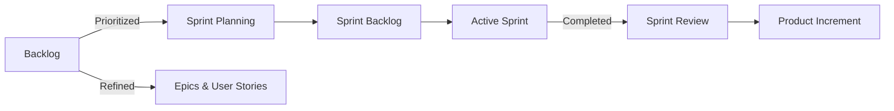

Here’s a concise **Jira Cheat Sheet** with key concepts, workflows, and how to track
building a website/web-scale app (like Amazon) using Jira:

---

### **1. Core Jira Concepts**

| Term            | Definition                                                                    | Relation to Others                    |
| --------------- | ----------------------------------------------------------------------------- | ------------------------------------- |
| **Backlog**     | Prioritized list of all work (features, bugs, tasks).                         | Source for Sprint Planning.           |
| **Sprint**      | Time-boxed iteration (usually 1-4 weeks) to complete selected backlog items.  | Pulls tasks from Backlog.             |
| **Epic**        | Large body of work (e.g., "Build Checkout Page").                             | Contains multiple User Stories/Tasks. |
| **User Story**  | Small, user-focused feature (e.g., "As a user, I want to add items to cart"). | Broken into Tasks.                    |
| **Task**        | Atomic work unit (e.g., "Implement Add to Cart API").                         | Child of User Story/Epic.             |
| **Sprint Goal** | Objective for the sprint (e.g., "Launch MVP of Product Page").                | Guides Sprint Backlog selection.      |

---

### **2. How They Work Together**



---

### **3. Tracking a Website/Web-Scale App**

#### **Step 1: Set Up Structure**

1. **Create Epics** (High-level features):

   - `Epic: User Authentication`
   - `Epic: Product Catalog`
   - `Epic: Checkout Flow`

2. **Break into User Stories**:

   - `User Story: Login with Email/Password`
   - `User Story: Search Products with Filters`

3. **Add Tasks**:
   - `Task: Design Login UI`
   - `Task: Implement JWT Auth`

#### **Step 2: Prioritize Backlog**

- Drag stories to order by priority (P0 = critical).
- Assign estimates (Story Points or Hours).

#### **Step 3: Plan Sprints**

1. **Sprint Goal Example**: "Launch Product Search".
2. **Select Stories/Tasks**:
   - `User Story: Search Products` (5 pts)
   - `Task: Optimize Elasticsearch Index` (3 pts).

#### **Step 4: Execute & Track**

- **Board View**: Move tasks from `To Do` → `In Progress` → `Done`.
- **Burndown Chart**: Track progress toward sprint goal.

---

### **4. Jira Workflow for Web-Scale Apps**

| Step                 | Action                                                          |
| -------------------- | --------------------------------------------------------------- |
| **Backlog Grooming** | Refine stories, add acceptance criteria, estimate.              |
| **Sprint Planning**  | Team commits to stories/tasks for the sprint.                   |
| **Daily Standup**    | Update progress in `Active Sprint` board.                       |
| **Sprint Review**    | Demo completed work (e.g., "Show checkout flow").               |
| **Retrospective**    | Discuss improvements (e.g., "Reduce tech debt in next sprint"). |

---

### **5. Advanced Tips for Scale**

- **Components**: Tag issues by area (`frontend`, `backend`, `database`).
- **Labels**: Use `scalability`, `security` for cross-cutting concerns.
- **Automation**:
  - Auto-assign bugs to `backend` team.
  - Trigger CI/CD pipelines on ticket completion.
- **Integrations**:
  - **Confluence**: Link specs to Jira tickets.
  - **Bitbucket/GitHub**: Tie commits to issues (`JIRA-123`).

---

### **6. Example: Amazon-Like Project Setup**

#### **Epics**:

1. `Epic: Product Discovery`
   - Stories: Search, Recommendations, Filters.
2. `Epic: Order Management`
   - Stories: Cart, Checkout, Payment.

#### **Sprint Backlog (2-Week Sprint)**:

| Story/Task                   | Points | Status      |
| ---------------------------- | ------ | ----------- |
| Implement Product Search API | 5      | In Progress |
| Optimize Catalog DB Indexing | 8      | To Do       |

#### **Metrics to Track**:

- **Velocity**: Avg story points completed per sprint.
- **Cycle Time**: Time from "In Progress" to "Done".

---

### **7. Key Jira Shortcuts**

| Action          | Shortcut (Cloud)          |
| --------------- | ------------------------- |
| Create Issue    | `C`                       |
| Search Issues   | `/`                       |
| Assign to Me    | `I` + Select Issue        |
| Sprint Planning | `Backlog` → `Plan Sprint` |

---

### **8. Tools for Scale**

- **Jira Advanced Roadmaps**: Track multi-team dependencies.
- **Jira Align**: For enterprise-scale (100+ teams).

---

### **9. Example Workflow**

1. **Backlog**:
   ```
   [P0] User Story: "Add to Cart"
   [P1] Task: "Optimize Cart DB"
   ```
2. **Sprint**:
   - Day 1-5: Develop "Add to Cart".
   - Day 6-10: Test + Deploy.
3. **Output**: Shippable feature increment.

---

### **10. Resources**

- [Jira Official Docs](https://www.atlassian.com/software/jira/guides)
- [Scrum Guide](https://www.scrum.org/resources/scrum-guide)

This cheat sheet helps you **start small** (single team) and **scale up** (Amazon-level).
Use Epics for vision, Sprints for execution, and Backlog for prioritization!
