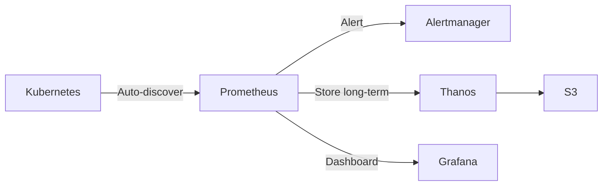

### **Why Prometheus (Not a Database) for Metrics?**

Prometheus is optimized for **time-series monitoring**, while traditional databases
(PostgreSQL, MySQL, etc.) are built for transactional data. Here’s why Prometheus shines
with examples:

---

### **1. High-Cardinality Metrics (Where Databases Fail)**

#### **Example: HTTP Request Tracking**

- **Prometheus**:

  ```promql
  http_requests_total{method="GET", path="/api", status="200", instance="server1"} 42
  ```

  - Stores millions of unique time series (one per `method`+`path`+`status`+`instance` combo).
  - **Efficient compression** for repeated labels.

- **Database (PostgreSQL)**:
  ```sql
  INSERT INTO http_requests (timestamp, method, path, status, instance, count)
  VALUES (NOW(), 'GET', '/api', '200', 'server1', 42);
  ```
  - **Problem**: Indexes slow down with high cardinality (`path` or `status` may have unlimited values).

---

### **2. Built-in Aggregations (Real-Time Calculations)**

#### **Example: Error Rate**

- **Prometheus**:

  ```promql
  rate(http_requests_total{status=~"5.."}[5m]) / rate(http_requests_total[5m])
  ```

  - Computes **% of 5xx errors over 5-minute windows** on the fly.

- **Database**:
  ```sql
   SELECT (
     SELECT COUNT(*) FROM http_requests WHERE status LIKE '5%' AND timestamp > NOW() - '5m'
   )::FLOAT / (
     SELECT COUNT(*) FROM http_requests WHERE timestamp > NOW() - '5m'
   ) AS error_rate;
  ```
  - **Problem**: Requires expensive table scans, slow for real-time dashboards.

---

### **3. Efficient Storage (Compared to DBs)**

#### **Example: CPU Usage**

- **Prometheus**:

  - Stores as a **compact time series**:  
    `cpu_usage{core="0"} 85.3` (timestamp auto-handled).
  - **~3.5 bytes/sample** (compressed, with timestamps).

- **Database**:
  ```sql
  INSERT INTO cpu_metrics (timestamp, core, usage) VALUES ('2023-10-01 12:00:00', 0, 85.3);
  ```
  - **Problem**: 20+ bytes/sample (timestamps, indexes, row overhead).

---

### **4. Specialized Query Language (PromQL)**

#### **Example: Alert on Memory Leak**

- **Prometheus**:

  ```promql
  increase(process_resident_memory_bytes[1h]) > 1GB
  ```

  - Triggers if memory grows by >1GB/hour.

- **Database**:
  ```sql
  WITH latest AS (
    SELECT usage FROM memory_metrics
    WHERE timestamp > NOW() - '1h' ORDER BY timestamp DESC LIMIT 1
  ), oldest AS (
    SELECT usage FROM memory_metrics
    WHERE timestamp > NOW() - '1h' ORDER BY timestamp ASC LIMIT 1
  )
  SELECT (latest.usage - oldest.usage) > 1073741824 FROM latest, oldest;
  ```
  - **Problem**: Complex, slow, and hard to maintain.

---

### **5. Native Service Discovery**

#### **Example: Dynamic Kubernetes Monitoring**

- **Prometheus**:

  - Auto-discovers pods/services via Kubernetes API.
  - Scrape config:
    ```yaml
    scrape_configs:
      - job_name: "kubernetes-pods"
        kubernetes_sd_configs: [{ role: "pod" }]
    ```

- **Database**:
  - Requires manual INSERTs or cron jobs to sync Kubernetes state.
  - **Problem**: No built-in dynamic discovery.

---

### **When to Use a Database Instead?**

1. **Event Logging** (e.g., user actions).
2. **Non-numeric data** (e.g., text logs).
3. **Transactions** (e.g., orders, payments).

---

### **Prometheus Metrics Cheat Sheet**

| Metric Type   | Example                           | Use Case                            |
| ------------- | --------------------------------- | ----------------------------------- |
| **Counter**   | `http_requests_total`             | Cumulative counts (e.g., requests). |
| **Gauge**     | `cpu_temp`                        | Current values (e.g., temperature). |
| **Histogram** | `request_duration_seconds_bucket` | Latency distributions.              |
| **Summary**   | `rpc_errors_sum`                  | Pre-aggregated quantiles.           |

---

### **Key Takeaways**

- **Prometheus excels at**:
  - High-volume numeric time series.
  - Real-time aggregations (PromQL).
  - Auto-scalable monitoring (e.g., Kubernetes).
- **Databases excel at**:
  - Transactional data.
  - Complex joins/relationships.

**Example Architecture**:



For metrics, **Prometheus is faster, cheaper, and simpler** than rolling your own DB solution.
