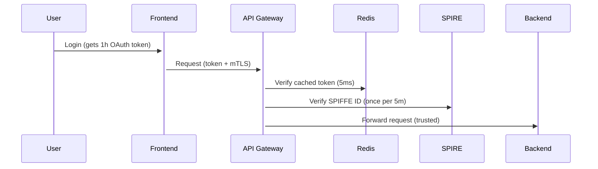

## The performance implications!:

---

### **1. Performance Optimization in Zero Trust**

#### **Problem**: Verifying both user (OAuth) and workload (SPIFFE) identities per request _is_ expensive.

#### **Solutions**:

| **Technique**            | **Implementation**                                                                  | **Performance Gain**           |
| ------------------------ | ----------------------------------------------------------------------------------- | ------------------------------ |
| **Caching**              | Cache validated OAuth tokens (e.g., Redis, 5-10ms vs. 50ms for Hydra introspection) | 10-100x faster                 |
| **Short-Lived Certs**    | SPIRE issues 5-min certs → no online checks after initial validation                | Zero latency after first check |
| **Batched Verification** | Gateways (e.g., Envoy) verify SPIFFE once per connection, not per request           | ~1μs per request               |
| **Edge Validation**      | Push OAuth validation to API gateways (e.g., OPA, Kong)                             | Offloads backend work          |

**Example Optimized Flow**:

---

### **2. Major Zero Trust Architectures**

#### **A. Google BeyondCorp** (Original ZTA)

- **For**: Employee/device access to apps
- **Tech**: Device certs + OAuth + IAP (Identity-Aware Proxy)
- **Languages**: Any (HTTP-based)

#### **B. SPIFFE/SPIRE** (Cloud-Native)

- **For**: Service-to-service auth
- **Tech**: X.509/JWT SVIDs + mTLS
- **Languages**: Go, Java, Python, C++ (via SDKs)

#### **C. Ory Hydra/Kratos** (User-Focused)

- **For**: End-user authentication
- **Tech**: OIDC/OAuth 2.0
- **Languages**: Any (HTTP/OpenID standards)

#### **D. Netflix BLESS** (Legacy)

- **For**: SSH access
- **Tech**: Short-lived SSH certs
- **Languages**: Python (Lambda)

#### **E. OpenZiti** (Network-Level)

- **For**: Encrypted overlay networks
- **Tech**: Embedded SDKs + private PKI
- **Languages**: Go, Java, C, Python

---

### **3. Language Support for Key ZTA Tools**

| **Tool**     | **Primary Language** | **SDK Support**                |
| ------------ | -------------------- | ------------------------------ |
| **SPIRE**    | Go                   | Go, Java, Python, C++          |
| **Hydra**    | Go                   | Any (OIDC/OAuth 2.0 standards) |
| **Kratos**   | Go                   | JavaScript (SPA), iOS, Android |
| **OpenZiti** | Go                   | Go, Java, Python, C, Rust      |
| **OPA**      | Go                   | REST/Rego (policy language)    |

---

### **4. When to Use What**

| **Use Case**                | **Recommended Stack**                  | **Why**                           |
| --------------------------- | -------------------------------------- | --------------------------------- |
| Microservices in Kubernetes | SPIFFE + OPA + Envoy                   | mTLS + policy enforcement         |
| Employee SaaS access        | BeyondCorp-style (Ory + IAP)           | Device + user auth                |
| IoT Devices                 | OpenZiti + SPIFFE                      | Encrypted comms + device identity |
| Legacy Apps                 | API Gateway (Kong) with JWT validation | No app changes needed             |

---

### **5. Emerging Optimizations**

- **WebAssembly (Wasm)**: Run OAuth/SPIFFE checks in proxies
  (e.g., Envoy WASM filters → sub-millisecond overhead).
- **eBPF**: Kernel-level verification (Cilium/Ziti).
- **Hardware Tokens**: TPM-backed SPIFFE IDs (0-latency attestation).

---

### **Key Takeaway**

Yes, naive ZTA implementations _can_ be expensive, but modern stacks optimize
this to **<1ms overhead per request** via:

1. **Caching** (OAuth tokens)
2. **Connection reuse** (SPIFFE certs)
3. **Hardware acceleration** (eBPF/TPM)

For most enterprises, the security benefits outweigh the ~1% CPU overhead. Start small
(e.g., SPIFFE for service mesh) before rolling out user-level ZTA.
