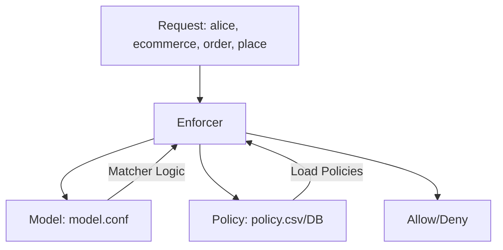

Let's break down **Casbin's architecture**, the logic behind `model.conf`
and `policy.csv`, and how permissions are stored and enforced.

---

### **1. Casbin Core Concepts**

Casbin follows the **Policy-as-Code** paradigm with two key components:

1. **`model.conf`**: Defines the **access control model** (how rules are evaluated).
2. **`policy.csv` (or DB)**: Contains **concrete permissions** (who can do what).

---

### **2. Deep Dive: `model.conf`**

This file defines the **logic of your access control system**.  
Example from your snippet:

```ini
[request_definition]
r = sub, dom, obj, act  # Request format: (subject, domain, object, action)

[policy_definition]
p = sub, dom, obj, act  # Policy format: (role, domain, object, action)

[role_definition]
g = _, _, _  # Role assignment: (user, role, domain)

[policy_effect]
e = some(where (p.eft == allow))  # "Allow if any rule matches"

[matchers]
m = g(r.sub, p.sub, r.dom) &&     # User has the role in the domain
    r.dom == p.dom &&              # Domain matches
    r.obj == p.obj &&              # Object (e.g., "order") matches
    r.act == p.act                 # Action (e.g., "place") matches
```

#### **Key Sections**:

- **`request_definition`**: Structure of `Enforce()` arguments (e.g., `alice, ecommerce, order, place`).
- **`policy_definition`**: How policies are stored (e.g., `pro_customer, ecommerce, cart, share`).
- **`role_definition`**: Role assignments (e.g., `alice, pro_customer, ecommerce`).
- **`matchers`**: The **logic** to evaluate requests against policies.

---

### **3. Deep Dive: `policy.csv`**

This file defines **concrete permissions** in the format specified by `policy_definition`.  
Example:

```csv
p, pro_customer, ecommerce, cart, share  # Policy: pro_customer can share cart in ecommerce
g, alice, pro_customer, ecommerce        # Role assignment: alice is a pro_customer in ecommerce
```

- **`p` lines**: Permissions for **roles** (not users directly).
- **`g` lines**: Role assignments (e.g., "alice has the pro_customer role in the ecommerce domain").

---

### **4. How `Enforce()` Works**

```go
ok, _ := e.Enforce("alice", "ecommerce", "order", "place")
```

Casbin checks:

1. **Role Lookup**: Does `alice` have any roles in `ecommerce`?
   - Checks `g` lines in policy (finds `alice, pro_customer, ecommerce`).
2. **Permission Check**: Does `pro_customer` have `(ecommerce, order, place)`?
   - Evaluates `m` in `model.conf` against `p` lines.
3. **Result**: Returns `true` if any `p` line matches.

---

### **5. Where Policies Are Stored**

Casbin **doesn’t dictate storage**. It supports:
| Storage | Use Case | Example |
|------------------|-----------------------------------|----------------------------------|
| **CSV/File** | Development/testing | `policy.csv` |
| **Database** | Production (dynamic updates) | MySQL, PostgreSQL |
| **Redis** | High-speed caching | Session-like permissions |
| **In-Memory** | Embedded systems | IoT devices |

#### **Example: Loading from DB (Go)**

```go
// Using GORM adapter
adapter, _ := gormadapter.NewAdapter("mysql", "user:pass@tcp(127.0.0.1:3306)/dbname")
e, _ := casbin.NewEnforcer("model.conf", adapter)

// Dynamically add a policy
e.AddPolicy("org_admin", "ecommerce", "subaccount", "delete")
```

---

### **6. Casbin Architecture**



1. **Model**: Rules engine (how to evaluate requests).
2. **Policy**: Concrete permissions (what roles can do).
3. **Adapter**: Bridge to storage (file, DB, Redis, etc.).

---

### **7. Dynamic vs. Static Permissions**

- **Static**: Stored in `policy.csv` (rarely changes).
- **Dynamic**:
  ```go
  // Add/remove policies at runtime
  e.AddPolicy("new_role", "ecommerce", "invoice", "view")
  e.RemovePolicy("alice", "ecommerce", "order", "cancel")
  ```

---

### **8. Why This Design?**

- **Separation of Concerns**:
  - `model.conf` = **logic** (how to decide).
  - `policy.csv` = **data** (who can do what).
- **Flexibility**: Change policies without touching code.
- **Performance**: Optimized policy evaluation (e.g., RBAC with domain support).

---

### **9. Real-World Example**

#### **Scenario**:

- User `alice` tries to `place` an `order` in `ecommerce`.

#### **Casbin Steps**:

1. Check `g` lines: Is `alice` assigned a role in `ecommerce`?
   - Finds `alice, pro_customer, ecommerce`.
2. Check `p` lines: Does `pro_customer` have `(ecommerce, order, place)`?
   - No → Deny.
3. If you add:
   ```go
   e.AddPolicy("pro_customer", "ecommerce", "order", "place")
   ```
   - Next `Enforce()` call → Allow.

---

### **10. Key Takeaways**

- **`model.conf`** = Rules engine (the "how").
- **`policy.csv`/DB** = Permissions (the "what").
- **`Enforce()`** evaluates requests against both.
- **Storage-agnostic**: Use files, DBs, or Redis.

This design lets you **decouple permission logic from business logic**,
making it easier to audit and update rules dynamically.

---

---

---

Let’s dive deeper into **extending Casbin’s model** and
**storing policies in a database** with practical examples.

---

### **1. Extending `model.conf` Beyond `sub, dom, obj, act`**

Casbin is **fully customizable**. You can define additional fields (e.g., `time`, `location`)
in both `model.conf` and `policy.csv`.

#### **Example: Time-Based Access Control**

```ini
[request_definition]
r = sub, dom, obj, act, time  # Added "time" field

[policy_definition]
p = sub, dom, obj, act, time  # Policy now includes time

[role_definition]
g = _, _, _

[policy_effect]
e = some(where (p.eft == allow))

[matchers]
m = g(r.sub, p.sub, r.dom) &&
    r.dom == p.dom &&
    r.obj == p.obj &&
    r.act == p.act &&
    time.Parse("15:04", r.time).After(time.Parse("15:04", "09:00"))  # Allow only after 9 AM
```

#### **Policy.csv with Time**

```csv
p, admin, ecommerce, order, approve, 08:00  # Will be denied (before 9 AM)
p, admin, ecommerce, order, approve, 10:00  # Allowed
```

---

### **2. Adding Custom Fields (e.g., IP/Device)**

```ini
[request_definition]
r = sub, dom, obj, act, ip

[policy_definition]
p = sub, dom, obj, act, ip

[matchers]
m = g(r.sub, p.sub, r.dom) &&
    r.dom == p.dom &&
    r.obj == p.obj &&
    r.act == p.act &&
    r.ip == p.ip  # Only allow from specific IPs
```

#### **Policy.csv with IP**

```csv
p, dev_team, internal, server, restart, 192.168.1.100
```

---

### **3. Storing Policies in a Database**

Casbin supports **databases via adapters**. Here’s how to use PostgreSQL:

#### **Step 1: DB Schema**

```sql
CREATE TABLE casbin_rule (
    id SERIAL PRIMARY KEY,
    ptype VARCHAR(8) NOT NULL,  -- "p" or "g"
    v0 VARCHAR(256),  -- sub/role
    v1 VARCHAR(256),  -- dom
    v2 VARCHAR(256),  -- obj
    v3 VARCHAR(256),  -- act
    v4 VARCHAR(256),  -- extra field (e.g., time)
    v5 VARCHAR(256)   -- extra field
);
```

#### **Step 2: Initialize Casbin with DB Adapter (Go)**

```go
import (
    "github.com/casbin/casbin/v2"
    gormadapter "github.com/casbin/gorm-adapter/v2"
    "gorm.io/driver/postgres"
    "gorm.io/gorm"
)

// Connect to PostgreSQL
dsn := "host=localhost user=postgres password=pass dbname=casbin port=5432"
db, _ := gorm.Open(postgres.Open(dsn), &gorm.Config{})

// Create adapter
adapter, _ := gormadapter.NewAdapterByDB(db)

// Load model and policies
e, _ := casbin.NewEnforcer("model.conf", adapter)

// Add a policy dynamically
e.AddPolicy("admin", "ecommerce", "order", "delete", "17:00")
```

#### **Resulting DB Entry**

| ptype | v0    | v1        | v2    | v3     | v4    |
| ----- | ----- | --------- | ----- | ------ | ----- |
| p     | admin | ecommerce | order | delete | 17:00 |

---

### **4. Complex `model.conf` Examples**

#### **Example 1: ABAC (Attribute-Based Access Control)**

```ini
[request_definition]
r = sub, dom, obj, act, time, status

[policy_definition]
p = sub, dom, obj, act

[matchers]
m = r.dom == p.dom &&
    r.obj == p.obj &&
    r.act == p.act &&
    r.status == "active" &&  # User must be active
    r.time.After("09:00")
```

#### **Example 2: Hierarchical Roles (RBAC with Inheritance)**

```ini
[role_definition]
g = _, _
g2 = _, _, _  # Supports multiple inheritance levels

[matchers]
m = g(r.sub, p.sub) || g2(r.sub, p.sub, r.dom)
```

---

### **5. Policy.csv → DB Migration**

If you start with CSV and later switch to DB:

```bash
# Using Casbin's command-line tool
casbin-cli migrate --src=csv --dst=postgresql \
    --src-file=policy.csv \
    --dst-conn="user=postgres password=pass dbname=casbin"
```

---

### **6. Key Takeaways**

- **Custom Fields**: Add any number of fields to `model.conf` and `policy.csv` (e.g., `time`, `ip`).
- **Database Storage**: Use adapters for PostgreSQL, MySQL, MongoDB, etc.
- **Dynamic Policies**: Modify policies at runtime via `AddPolicy()`/`RemovePolicy()`.
- **Complex Models**: Combine RBAC, ABAC, and custom logic in `matchers`.

---

### **7. Advanced Use Case: Hybrid RBAC + ABAC**

```ini
[matchers]
m = (g(r.sub, p.sub, r.dom) && r.obj == p.obj) ||  # RBAC
    (r.obj == "invoice" && r.act == "approve" && r.sub == p.sub && r.dom == "finance" && r.amount < 10000)  # ABAC
```

This allows:

- Role-based access **AND**
- Attribute-based rules (e.g., "Only approve invoices < $10,000").

---

### **8. References**

- [Casbin Model Syntax](https://casbin.org/docs/model-storage)
- [Database Adapters](https://casbin.org/docs/adapters)

By extending `model.conf` and leveraging databases, you can model **any access control scenario** while keeping your business logic clean.
